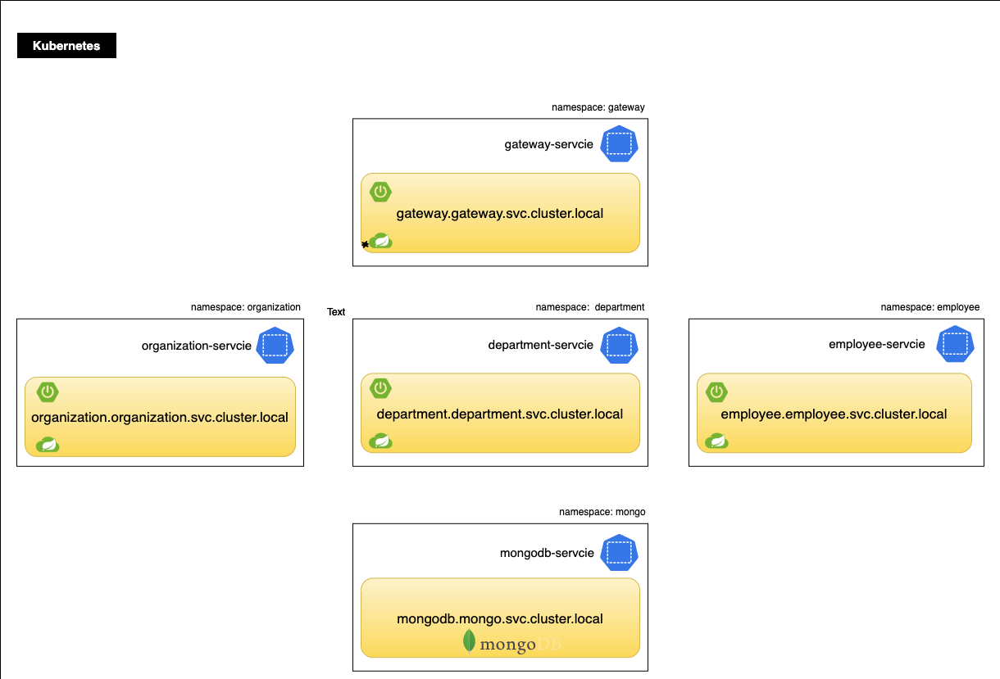

# Arquitetura de Referência com Spring Cloud Kubernetes

Esta arquitetura de referência tem por objetivo demonstrar design, desenvolvimento e deployment de microservicos [`Spring Boot`](https://spring.io/projects/spring-boot) em [`Kubernetes`](https://kubernetes.io/).
Cada seção cobrirá recomendações arquiteturais e configurações para cada quando aplicável.

### Recomendações chaves de alto-nível

* Considerando melhores práticas para `aplicações nativas em nuvem` e os [`12 fatores`](https://12factor.net/pt_br/). 
* Mantenha cada microserviços em um projeto [`maven`](https://maven.apache.org/) ou [`gradle`](https://gradle.org/) separado.
* Prefira utilizar dependências ao herdar de um projeto pai no lugar de utilizar um caminho relativo.
* Utilize o [`Spring Initializr`](https://start.spring.io
  ) para poder gerar uma estrutura de projeto para Spring Boot.

Esta arquitetura demonstra um aplicativo nativo em nuvem complexo que abordará as seguintes questões:

* Configuração externalizada utilizando `ConfigMaps`, `Secrets` e `PropertySource`
* Acesso ao servidor da API Kubernetes utilizando `ServiceAccounts`, `Roles` e `RoleBidings`.
* Verificação de saúde/estado utilizando sondas
    * `readinessProbe`
    * `livenessProbe`
    * `startupProbe`
* Relatório deo estado do aplicativo por meio do Spring Boot [`Actuators`](https://docs.spring.io/spring-boot/docs/current/reference/html/actuator.html)    
* Descoberta de serviço por [`namespaces`](https://kubernetes.io/docs/concepts/overview/working-with-objects/namespaces/) utilizando `DiscoveryClient`
* Construção de imagem [`Docker`](https://www.docker.com/) utilizando boas práticas
* [`Layering JARs`](https://spring.io/blog/2020/08/14/creating-efficient-docker-images-with-spring-boot-2-3) utilizando o plugin do SpringBoot
* Observando a aplicação utilizando exportadores como [`Prometheus`](https://www.prometheus.io/)

## Arquitetura de Referência

A arquitetura de referência demonstra uma organização onde cada unidade tem seu próprio aplicativo projetado utilizando uma arquitetura de microserviços.
Os microserviços serão expostos através `APIs REST` utilizando Spring Boot em um servidor Tomcat integrado e implantado no Kubernetes.

Cada microserviço é implantado em seu próprio `namespace`. Colocar microserviços em namespaces distintos permite agrupamento lógico que facilita o gerenciamento de privilégios de acesso, atribuindo-lhes apenas uma equipe responsável por um determinado aplicativo. O `Spring Cloud Kubernetes Discovery Client` torna a comunicação interna entre microserviços perfeita. Ele se comunica com a API Kubernetes para descobrir os IPs de todos os serviços em execução nos `PODs`.

O aplicativo implementa nesta Arquitetura de Referência é construído com vários componentes de código aberto, comumente encontrados na maioria das implantações de microserviços Spring Boot. Esse incluem:

* [`Spring Cloud Kubernetes`](https://spring.io/projects/spring-cloud-kubernetes): fornece integração com servidor de API Kubernetes para permitir a descoberta de serviço, configuração e balanceamento de carga utilizando pelo Spring Cloud.
* [`Spring Cloud`](https://spring.io/projects/spring-cloud): fornece ferramentas para que os desenvolvedores criem rapidamente padrões comuns em sistemas distruídos.
    * [`OpenFeign`](https://spring.io/projects/spring-cloud-openfeign) - Binder de cliente Java para HTTP
    * [`Zuul`](https://spring.io/projects/spring-cloud-gateway) - solicitações de roteamento e filtragem para um microserviço.
    * [`Sleuth`](https://spring.io/projects/spring-cloud-sleuth) - um ferramenta para rastreamento distribuído
    * `Swagger` - conjunto de ferramentas de código aberto construído em torno da especificação OpenAPI que pode projetar, construir, documentar e consumir APIs REST.
    * `UI Swagger` - fornece iteração e visualização de recursos de API sem escrever lógica customizada.


## Ambiente da Arquitetura de Referência

Cada microserviços é executado em seu próprio contêiner, um contêiner por pod e um pod por replica de serviço. O aplicativo é contruído utilizando um arquitetura de microserviços e representado por contêineres replicados que chamam uns aos outros.


## Spring Cloud Kubernetes

Spring Cloud Kubernetes fornece implantações do Spring Cloud de interfaces comuns que consomem serviços nativos do Kubernetes. Seu objetivo é facilitar a integração dos aplicativos Spring Cloud e Spring Boot em execução no Kubernetes.

Spring Cloud Kubernetes integra-se à API Kubernetes e permite a descoberta, configuração e balanceamento de carge do serviço. Essa arquitetura de referência demonstra o uso dos seguintes recursos do Spring Cloud Kubernetes:

* Descobrir serviços em todos os namespaces utilizando o Spring Cloud DiscoveryClient.
* Utilizar ConfigMap e Secrets como fontes de propriedades do Srping Boot com Spring Cloud Kubernetes Config.
* Implementar verificações de integridade utilizando o indicador de integridade do pod do Spring Cloud Kubernetes.

## Ativando Spring Cloud Kubernetes

Adicione a seguinte dependência para ativar os recursos do Spring Cloud Kubernetes no projeto.
A biblioteca contém módulos para descoberta de serviços, configuração e balanceamento de carga (Ribbon).

```xml
<dependency>
  <groupId>org.springframework.cloud</groupId>
  <artifactId>spring-cloud-starter-kubernetes-all</artifactId>
</dependency>
```

## Habilitando Service Discovery em todos os namespaces

Spring Cloud Kubernetes permite a descoberta de serviço do Kubernetes com aplicativos Spring Boot, fornecendo um implementação de Discovery Client. O cliente (Ribbon) se comunica diretamente com os pods, ao invés de comunicar-se por meio dos serviços kubernetes.
Isso permite um balanceamento de carga mais completo em oposição ao `round robin, que é forçado ao passar pelos serviços Kubernetes.
Ribbon é utilizando por cliente HTTP de alto-nível [OpenFeign](https://cloud.spring.io/spring-cloud-openfeign/reference/html).
MongoBD será utilizado para o repositório de dados. Swagger2 é um projeto de código aberto utilizado para gerar a documentação REST API para RESTfult web services.

```file
/spring-microservices-k8s/department-service/src/main/java/vmware/services/department/DepartmentApplication.java
```

```java
@SpringBootApplication
@EnableDiscoveryClient
@EnableFeignClients
@EnableMongoRepositories
@EnableSwagger2
@AutoConfigureAfter(RibbonAutoConfiguration.class)
@RibbonClients(defaultConfiguration = RibbonConfiguration.class)
public class DepartmentApplication {

    public static void main(String[] args) {
        SpringApplication.run(DepartmentApplication.class, args);
    }

    @Bean
    public Docket swaggerApi() {
        return new Docket(DocumentationType.SWAGGER_2)
                .select()
                .apis(RequestHandlerSelectors.basePackage("vmware.services.department.controller"))
                .paths(PathSelectors.any())
                .build()
                .apiInfo(new ApiInfoBuilder().version("1.0").title("Department API").description("Documentation Department API v1.0").build());
    }
}
```

Para habilitar a descoberta em todos os namespaces, a propriedade `all-namespaces` precisa ser definida com `true`.

```file
/spring-microservices-k8s/k8s/department-configmap.yaml
```

```yaml
kind: ConfigMap
apiVersion: v1
metadata:
  name: department
data:
  spring.cloud.kubernetes.discovery.all-namespaces: "true"
  # other config removed for brevity.
```

Feign é um cliente de serviço web declarativo. Para comunicar-se com `employee-service` em `department-service` precisamos criar uma interface e utilizar a anotação `@FeignClient`.
Na anotação `@FeignClient`, o valor da string `"employee"` é um nome arbitrário para o cliente, que é utilizado para criar/mapear um balanceador de carga no Ribbon. 
O nome do bean no contexto do aplicativo é um nome totalmente qualificado interface. Em tempo execução, `employee`será resolvido com uma pesquisa no servidor de descoberta para um endereço IP de `employee` no serviço kubernetes.

```file
/spring-microservices-k8s/department-service/src/main/java/vmware/services/department/client/EmployeeClient.java
```

```java
@FeignClient(name = "employee")
public interface EmployeeClient {

    @GetMapping("/department/{departmentId}")
    List<Employee> findByDepartment(@PathVariable("departmentId") String departmentId);

}
```

## Criando namespaces do Kubernetes

Crie namespaces do Kubernetes para cada microserviço.

```script
kubectl create namespace department
kubectl create namespace employee
kubectl create namespace gateway
kubectl create namespace organization
kubectl create namespace mongo
```

## Configurando Spring Cloud Kubernetes para acessar a API Kubernetes

Spring Cloud Kubernetes requer acesso à API Kubernetes para poder recuperar a lista de endereços IP dos pods que serão liderados por um único serviço. A maneira mais simples de fazer isso é definir uma lista `ClusterRole`com recursos e verbos. 

```file
/spring-microservices-k8s/k8s/rbac-cluster-role.yaml
```

```yaml
kind: ClusterRole
apiVersion: rbac.authorization.k8s.io/v1
metadata:
  namespace: default
  name: microservices-kubernetes-namespace-reader
rules:
  - apiGroups: [""] # "" indicates the core API group
    resources: ["configmaps", "pods", "services", "endpoints", "secrets"]
    verbs: ["get", "list", "watch"]
```
Em seguida, crie-o no `default` namespaces.

```script
kubectl apply -f ../k8s/rbac-cluster-role.yaml -n default
```

Crie contas de serviço para `api-service-account`

```script
kubectl create serviceaccount api-service-account -n department
kubectl create serviceaccount api-service-account -n employee
kubectl create serviceaccount api-service-account -n gateway
kubectl create serviceaccount api-service-account -n organization
kubectl create serviceaccount api-service-account -n mongo
```

vincule contas de serviço `api-service-account` de cada namespace a `ClusterRole`

```script
kubectl create clusterrolebinding service-pod-reader-department --clusterrole=microservices-kubernetes-namespace-reader --serviceaccount=department:api-service-account
kubectl create clusterrolebinding service-pod-reader-employee --clusterrole=microservices-kubernetes-namespace-reader --serviceaccount=employee:api-service-account
kubectl create clusterrolebinding service-pod-reader-gateway --clusterrole=microservices-kubernetes-namespace-reader --serviceaccount=gateway:api-service-account
kubectl create clusterrolebinding service-pod-reader-organization --clusterrole=microservices-kubernetes-namespace-reader --serviceaccount=organization:api-service-account
kubectl create clusterrolebinding service-pod-reader-mongo --clusterrole=microservices-kubernetes-namespace-reader --serviceaccount=mongo:api-service-account
```

e certifique-se de que os manifestos de implantações para cada conta de serviço de referência de microserviços `api-service-account`

* `/spring-microservices-k8s/k8s/department-deployment.yaml`

* `/spring-microservices-k8s/k8s/employee-deployment.yaml`

* `/spring-microservices-k8s/k8s/organization-deployment.yaml`


```
# other config removed for brevity.
serviceAccountName: api-service-account
```

## Nomenclatura de serviço kubernetes

Cada serviço definido no cluster (incluindo o próprio servidor DNS) recebe um nome DNS. Os serviços ''normais'' (not headless) são atribuídos a um registro DNS A ou AAAA, dependendo da família de IP do serviço, para um nome na forma `my-svc.my-namespace.svc.cluster-domain.example`. Isso é resolvido para o IP do cluster do serviço. 

Os registros DNS para cada serviços são os seguintes:

