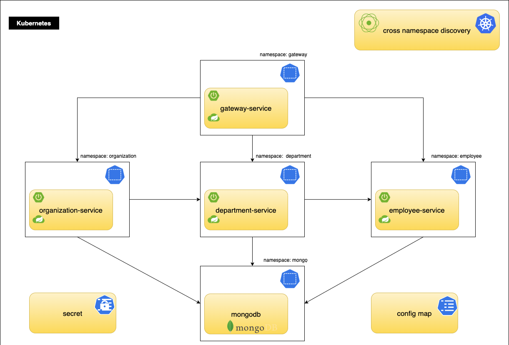
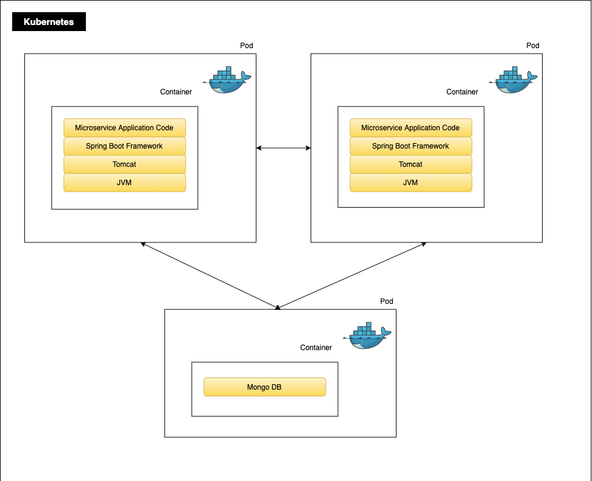

# Arquitetura de Referência com Spring Cloud Kubernetes

Esta arquitetura de referência tem por objetivo demonstrar design, desenvolvimento e deployment de microservicos [`Spring Boot`](https://spring.io/projects/spring-boot) em [`Kubernetes`](https://kubernetes.io/).
Cada seção cobrirá recomendações arquiteturais e configurações para cada quando aplicável.

### Recomendações chaves de alto-nível

* Considerando melhores práticas para `aplicações nativas em nuvem` e os [`12 fatores`](https://12factor.net/pt_br/). 
* Mantenha cada microserviços em um projeto [`maven`](https://maven.apache.org/) ou [`gradle`](https://gradle.org/) separado.
* Prefira utilizar dependências ao herdar de um projeto pai no lugar de utilizar um caminho relativo.
* Utilize o [`Spring Initializr`](https://start.spring.io
  ) para poder gerar uma estrutura de projeto para Spring Boot.

Esta arquitetura demonstra um aplicativo nativo em nuvem complexo que abordará as seguintes questões:

* Configuração externalizada utilizando `ConfigMaps`, `Secrets` e `PropertySource`
* Acesso ao servidor da API Kubernetes utilizando `ServiceAccounts`, `Roles` e `RoleBidings`.
* Verificação de saúde/estado utilizando sondas
    * `readinessProbe`
    * `livenessProbe`
    * `startupProbe`
* Relatório deo estado do aplicativo por meio do Spring Boot [`Actuators`](https://docs.spring.io/spring-boot/docs/current/reference/html/actuator.html)    
* Descoberta de serviço por [`namespaces`](https://kubernetes.io/docs/concepts/overview/working-with-objects/namespaces/) utilizando `DiscoveryClient`
* Construção de imagem [`Docker`](https://www.docker.com/) utilizando boas práticas
* [`Layering JARs`](https://spring.io/blog/2020/08/14/creating-efficient-docker-images-with-spring-boot-2-3) utilizando o plugin do SpringBoot
* Observando a aplicação utilizando exportadores como [`Prometheus`](https://www.prometheus.io/)

## Arquitetura de Referência

A arquitetura de referência demonstra uma organização onde cada unidade tem seu próprio aplicativo projetado utilizando uma arquitetura de microserviços.
Os microserviços serão expostos através `APIs REST` utilizando Spring Boot em um servidor Tomcat integrado e implantado no Kubernetes.

Cada microserviço é implantado em seu próprio `namespace`. Colocar microserviços em namespaces distintos permite agrupamento lógico que facilita o gerenciamento de privilégios de acesso, atribuindo-lhes apenas uma equipe responsável por um determinado aplicativo. O `Spring Cloud Kubernetes Discovery Client` torna a comunicação interna entre microserviços perfeita. Ele se comunica com a API Kubernetes para descobrir os IPs de todos os serviços em execução nos `PODs`.

O aplicativo implementa nesta Arquitetura de Referência é construído com vários componentes de código aberto, comumente encontrados na maioria das implantações de microserviços Spring Boot. Esse incluem:

* [`Spring Cloud Kubernetes`](https://spring.io/projects/spring-cloud-kubernetes): fornece integração com servidor de API Kubernetes para permitir a descoberta de serviço, configuração e balanceamento de carga utilizando pelo Spring Cloud.
* [`Spring Cloud`](https://spring.io/projects/spring-cloud): fornece ferramentas para que os desenvolvedores criem rapidamente padrões comuns em sistemas distruídos.
    * [`OpenFeign`](https://spring.io/projects/spring-cloud-openfeign) - Binder de cliente Java para HTTP
    * [`Zuul`](https://spring.io/projects/spring-cloud-gateway) - solicitações de roteamento e filtragem para um microserviço.
    * [`Sleuth`](https://spring.io/projects/spring-cloud-sleuth) - um ferramenta para rastreamento distribuído
    * `Swagger` - conjunto de ferramentas de código aberto construído em torno da especificação OpenAPI que pode projetar, construir, documentar e consumir APIs REST.
    * `UI Swagger` - fornece iteração e visualização de recursos de API sem escrever lógica customizada.

## Ambiente da Arquitetura de Referência

Cada microserviços é executado em seu próprio contêiner, um contêiner por pod e um pod por replica de serviço. O aplicativo é contruído utilizando um arquitetura de microserviços e representado por contêineres replicados que chamam uns aos outros.

## Spring Cloud Kubernetes

Spring Cloud Kubernetes fornece implantações do Spring Cloud de interfaces comuns que consomem serviços nativos do Kubernetes. Seu objetivo é facilitar a integração dos aplicativos Spring Cloud e Spring Boot em execução no Kubernetes.

Spring Cloud Kubernetes integra-se à API Kubernetes e permite a descoberta, configuração e balanceamento de carge do serviço. Essa arquitetura de referência demonstra o uso dos seguintes recursos do Spring Cloud Kubernetes:

* Descobrir serviços em todos os namespaces utilizando o Spring Cloud DiscoveryClient.
* Utilizar ConfigMap e Secrets como fontes de propriedades do Srping Boot com Spring Cloud Kubernetes Config.
* Implementar verificações de integridade utilizando o indicador de integridade do pod do Spring Cloud Kubernetes.

